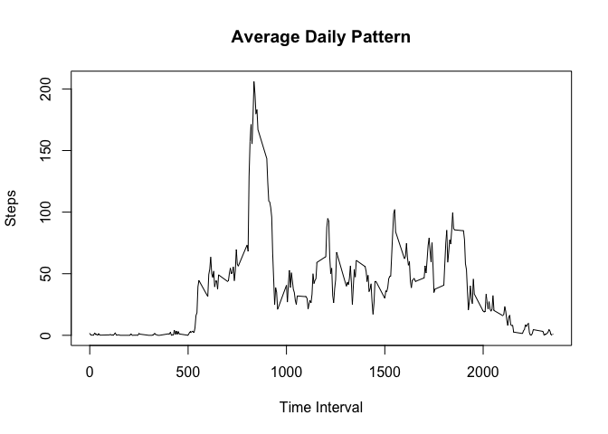
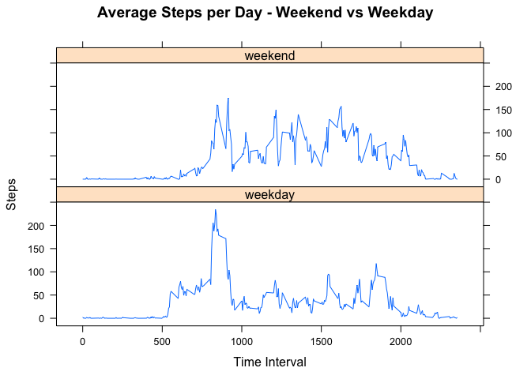

# Reproducible Research: Peer Assessment 1


## Loading and preprocessing the data

```r
library(plyr)
library(lattice)

activity <- read.csv('activity.csv')
```
## What is mean total number of steps taken per day?

```r
# Total Number of Steps Per Day
stepsPerDay <- ddply(activity,~date,summarise,sum=sum(steps,na.rm = TRUE))

# Histogram of Total Number of Steps Per Day
with(stepsPerDay, hist(sum, xlab="Steps", main="Steps per Day"))
```

 

```r
# Mean and Median steps per day
meanStepsPerDay <- round(mean(stepsPerDay$sum), digits=0)
medianStepsPerDay <- median(stepsPerDay$sum)
```
The mean steps per day is 9354.
The median steps per day is 10395.

## What is the average daily activity pattern?

```r
# Average Steps Per Interval
avgStepsInt <- ddply(activity,~interval,summarise,mean=mean(steps,na.rm = TRUE))

plot(avgStepsInt$interval, avgStepsInt$mean, type='l', main = "Average Daily Pattern",
     xlab="Time Interval", ylab="Steps")
```

 

```r
# 5 Minute interval with max average number of steps
maxStepsInt <- subset(avgStepsInt, mean==max(avgStepsInt$mean))$interval
```

The following 5-minute interval (on average) contains the max number of steps: 835

## Imputing missing values

```r
# Calculate the total number of rows with NA values
misValCount <- sum(is.na(activity$steps))


# To deal with with NA values, the strategy used is to calculate the average number
# of steps per 5 minute interval and use that value to susbstitute NA values in the dataset

calcMean <- function(x) replace(x, is.na(x), mean(x, na.rm = TRUE))
activityAdjusted <- ddply(activity, ~ interval, transform, steps = calcMean(steps))

sum(is.na(activityAdjusted))
```

```
## [1] 0
```

```r
# Histogram of Steps per Day with NA values replaced with average steps/5 min interval
stepsPerDay <- ddply(activityAdjusted,~date,summarise,sum=sum(steps,na.rm = TRUE))
with(stepsPerDay, hist(sum, xlab="Steps", main="Steps per Day (NAs Replaced with Average Steps/5 Min Interval)"))
```

 

```r
# Mean and Median steps per day with NA values replaced with average steps/5 min interval
meanStepsPerDay <- as.integer(mean(stepsPerDay$sum))
medianStepsPerDay <- as.integer(median(stepsPerDay$sum))
```
The total number of missing values is 2304.  
The mean steps per day (NAs replaced with Avg Steps/5 Min Interval)  is 10766.  
The median steps per day (NAs replaced with Avg Steps/5 Min Interval) is 10766.


## Are there differences in activity patterns between weekdays and weekends?

```r
# Convert activity$date to a date field
activity$date <- as.Date(activity$date)

# Create a list of labels for each weekday
wdayName <- c('Monday', 'Tuesday', 'Wednesday', 'Thursday', 'Friday')

#Use `%in%` and `weekdays` to create a logical vector
#convert to `factor` and specify the `levels/labels`

# Use the weekdays function to determine the day of the week for each date
# and assign the appropriate weekend or weekday factor variable
activity$dayType <-  factor((weekdays(activity$date) %in% wdayName) + 1L,
                            levels=1:2, labels=c('weekend', 'weekday'))

# Subset data into weekday and weekend dataframes
actWday <- activity[activity$dayType == "weekday", ]
actWend <- activity[activity$dayType == "weekend", ]

# Calculate average Steps Per Interval for the weekday and weekend dataframes
avgStepsIntWday <- ddply(actWday,~interval,summarise,mean=mean(steps,na.rm = TRUE))
avgStepsIntWend <- ddply(actWend,~interval,summarise,mean=mean(steps,na.rm = TRUE))

# Add a dayType variable to each dataframe the combine the weekday and weekend dataframes
avgStepsIntWday$dayType <- 'weekday'
avgStepsIntWend$dayType <- 'weekend'
avgStepsIntAll <- rbind(avgStepsIntWday, avgStepsIntWend)

# Two panel plots with Average Steps per Day - plotted by weekend and weekday

xyplot(mean ~ interval | dayType, data = avgStepsIntAll, type ='l', layout = c(1, 2),
       main="Average Steps per Day - Weekend vs Weekday", xlab="Time Interval", ylab="Steps")
```

 
